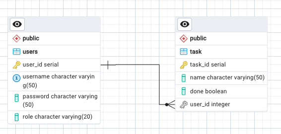

# Fourthingsplus

Dette repo indeholder et forslag til løsning på opgaven:

- [Fourthingsplus](https://github.com/dat2Cph/content/blob/main/webstack/backend/fourthingsplus.md)

I denne udgave implementeres løsningen lidt ad gangen.

Databasen er oprettet med to tabeller i Postgres:

Først skal du oprette en database ved navn `fourthingsplus`

Dernæst åbner du en query editor i PgAdmin, kopierer dette script ind og kører det:

```sql
-- Database: fourthingsplus
--
-- PostgreSQL database dump
--

CREATE SEQUENCE public.task_task_id_seq
    AS integer
    START WITH 1
    INCREMENT BY 1
    NO MINVALUE
    NO MAXVALUE
    CACHE 1;

ALTER SEQUENCE public.task_task_id_seq OWNER TO postgres;

SET default_tablespace = '';

SET default_table_access_method = heap;

CREATE TABLE public.task (
                             task_id integer DEFAULT nextval('public.task_task_id_seq'::regclass) NOT NULL,
                             name character varying NOT NULL,
                             done boolean DEFAULT false NOT NULL,
                             user_id integer NOT NULL
);

ALTER TABLE public.task OWNER TO postgres;

CREATE SEQUENCE public.users_user_id_seq
    AS integer
    START WITH 1
    INCREMENT BY 1
    NO MINVALUE
    NO MAXVALUE
    CACHE 1;

ALTER SEQUENCE public.users_user_id_seq OWNER TO postgres;

CREATE TABLE public.users (
                              user_id integer DEFAULT nextval('public.users_user_id_seq'::regclass) NOT NULL,
                              username character varying(50) NOT NULL,
                              password character varying(50),
                              role character varying(20) DEFAULT 'user'::character varying NOT NULL
);

ALTER TABLE public.users OWNER TO postgres;


INSERT INTO public.task VALUES (1, 'Se Jons videoer', false, 1);

INSERT INTO public.users VALUES (1, 'jon', '1234', 'user');

SELECT pg_catalog.setval('public.task_task_id_seq', 1, true);

SELECT pg_catalog.setval('public.users_user_id_seq', 1, true);

ALTER TABLE ONLY public.task
    ADD CONSTRAINT task_pkey PRIMARY KEY (task_id);

ALTER TABLE ONLY public.users
    ADD CONSTRAINT user_name_unique UNIQUE (username);

ALTER TABLE ONLY public.users
    ADD CONSTRAINT users_pkey PRIMARY KEY (user_id);

ALTER TABLE ONLY public.task
    ADD CONSTRAINT fk_user_task FOREIGN KEY (user_id) REFERENCES public.users(user_id) NOT VALID;
```

Så er databasen klar til brug. Genererer evt. et ERD for at tjekke at alt er i orden.

Det skulle gerne se således ud:


